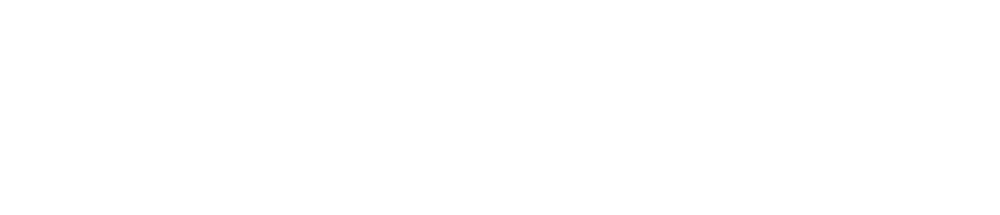

<!-- Improved compatibility of back to top link: See: https://github.com/othneildrew/Best-README-Template/pull/73 -->
<a id="readme-top"></a>

<!--  *** Thanks for checking out the Best-README-Template. If you have a suggestion that would make this better, please fork the repo and create a pull request or simply open an issue with the tag "enhancement". Don't forget to give the project a star! Thanks again! Now go create something AMAZING! :D -->


<!-- /// d   u   b   p   i   x   e   l  ---  f   o   r   k   ////--v0.5.6 -->
<!--this has additionally been modifed by @dubpixel for hardware use -->
<!--search dpx_new_project.. search & replace is COMMAND OPTION F -->

<!--this is the version for sofrware only-->
<!--todo add small product image thats not in a details tag -->
<!--igure out how to get the details tag to properly render in jekyll for gihub pages.-->


<!-- PROJECT SHIELDS -->
<!--
*** I'm using markdown "reference style" links for readability.
*** Reference links are enclosed in brackets [ ] instead of parentheses ( ).
*** See the bottom of this document for the declaration of the reference variables
*** for contributors-url, forks-url, etc. This is an optional, concise syntax you may use.
*** https://www.markdownguide.org/basic-syntax/#reference-style-links
***
-->
<div align="center">

[![Contributors][contributors-shield]][contributors-url]
[![Forks][forks-shield]][forks-url]
[![Stargazers][stars-shield]][stars-url]
[![Issues][issues-shield]][issues-url]
[![MIT License][license-shield]][license-url]
[![LinkedIn][linkedin-shield]][linkedin-url]
</div>
<!-- PROJECT LOGO -->
<div align="center">
  <a href="https://github.com/dubpixel/dpx_new_project">
    
  </a>
<h1 align="center">dpx_new_project</h1>
<h3 align="center"><i>a script to create new project structures</i></h3>
  <p align="center">
    ...like taking out the garbage...
    <br />
     »  
     <a href="https://github.com/dubpixel/dpx_new_project"><strong>Project Here!</strong></a>
     »  
     <br />
    <a href="https://github.com/dubpixel/dpx_new_project/issues/new?labels=bug&template=bug-report---.md">Report Bug</a>
    ·
    <a href="https://github.com/dubpixel/dpx_new_project/issues/new?labels=enhancement&template=feature-request---.md">Request Feature</a>
    </p>
</div>
   <br />
<!-- TABLE OF CONTENTS -->
<details>
  <summary><h3>Table of Contents</h3></summary>
<ol>
    <li>
      <a href="#about-the-project">About The Project</a>
      <ul>
        <li><a href="#built-with">Built With</a></li>
      </ul>
    </li>
    <li>
      <a href="#getting-started">Getting Started</a>
      <ul>
        <li><a href="#prerequisites">Prerequisites</a></li>
        <li><a href="#installation">Installation</a></li>
      </ul>
    </li>
    <li><a href="#usage">Usage</a></li>    
    <li><a href="#reflection">Reflection</a></li>
    <li><a href="#roadmap">Roadmap</a></li>
    <li><a href="#contributing">Contributing</a></li>
    <li><a href="#license">License</a></li>
    <li><a href="#contact">Contact</a></li>
    <li><a href="#acknowledgments">Acknowledgments</a></li>
</ol>
</details>
<!-- ABOUT THE PROJECT -->
<details>
<summary><h3>About The Project</h3></summary>
  Creating new base projects properly is basically a chore when you have a spark of an idea. new folder, new file, LFG...
 and I was constantly avoiding pushing things to github as they werent formatted properly or they had been forked from another project and the .md had not been updated. 
  
  _This sort of thing is like taking out the trash, it sucks when you dont but usually its a pain when you do._
this hopefully makes it suck less in the future & I can continue to add to this as needed. 
  
Script is  designed to quickly deploy a new project  based on the dubpixel standard templates. Selectively copy files and structure based on cmd line flags. It is designed to work witk:
https://github.com/dubpixel/dpx_readme_template


It was created using Claude Sonnet 4.(oHno3!) -  You can see the directives used in taking a little bit the eagerness of claude (golden retriever energy); they worked pretty well for the most part, just needed to remind the AI to review a few times. It was so effective i created several ai code templats and out them into the template repo for later. 

Additionally the ai was fuly briefed with an extensive set of paramaters about how the project should function then echo those back to the comments, before starting to code. This was helpful to review with the AI later on, as well as clarify where it might be confused. before acting on bad information and creating code that does things we do not want. Big note was before ever writing one line of code i wrote close to 100 lines of description. Then told the ai to do exactly what I wanted. The code worked on 2nd run. One small bugfix that caused a few files to not get created first time around. 

</br>

*architect(s): // www.dubpixel.tv  - i@dubpixel.tv 
</br>
<h3>Images</h3>

### FRONT
![FRONT][product-front]
</details>
<p align="right">(<a href="#readme-top">back to top</a>)</p>

### Built With 
 
 *  Claude Sonnet 4

<!--
 * [![KiCad][KiCad.org]][KiCad-url]
 * [![Fusion360][Fusion-360]][Autodesk-url]
 * [![FastLed][FastLed.io]][FastLed-url]
 * [![Fusion360][Fusion-360]][Autodesk-url]
 * [![Next][Next.js]][Next-url]
 * [![React][React.js]][React-url]
 * [![Vue][Vue.js]][Vue-url]
 * [![Angular][Angular.io]][Angular-url]
 * [![Svelte][Svelte.dev]][Svelte-url]
 * [![Laravel][Laravel.com]][Laravel-url]
 * [![Bootstrap][Bootstrap.com]][Bootstrap-url]
 * [![JQuery][JQuery.com]][JQuery-url]
 
-->
<p align="right">(<a href="#readme-top">back to top</a>)</p>
<!-- GETTING STARTED -->

## Getting Started

  ### Prerequisites
  * [dpx_readme_template](https://github.com/dubpixel/dpx_readme_template) must be installed at the same folder level as this project folder.
  * 
  ### Installation
  * download and extract, install to same folder as the template
  * make sure that dpx_new_project/src/dpx_new_project.sh is +rw


<p align="right">(<a href="#readme-top">back to top</a>)</p>

<!-- USAGE EXAMPLES -->
## Usage

### Basic Usage
```bash
./dpx_newProject.sh <project_name> <-H|-S> [-V] [-M 'sassy tagline'] [-C 'project description']
```

**Arguments:**
- `project_name`: Name of the new project (required, first argument)
- `-H`: Hardware project
- `-S`: Software project  
- `-V`: Verbose output (optional)
- `-M 'message'`: Sassy tagline for the project (optional)
- `-C 'comment'`: Longer description for the project (optional)

**Examples:**
```bash
./dpx_newProject.sh gendrigus_500 -V -H
./dpx_newProject.sh my_app -S -M "The coolest software ever" -C "A comprehensive solution for all your needs"
```

### Global Installation (Symlink Setup)

For convenient access from anywhere on your system:

#### 1. Create Symlink
```bash
sudo ln -s "/path/to/your/DPX_NEW_PROJECT/src/dpx_newProject.sh" /usr/local/bin/dpx-new-project
```

#### 2. Set Environment Variables
Add to your shell profile (`~/.zshrc` or `~/.bash_profile`):
```bash
# DPX Project Generator Settings
export DPX_ROOT="/path/to/your/_...CIRCUIT_PROJECTS"
export DPX_PROJECTS_DIR="$HOME/projects"  # Optional: customize project location
```

Reload your shell:
```bash
source ~/.zshrc  # or source ~/.bash_profile
```

#### 3. Use From Anywhere
```bash
dpx-new-project my_awesome_project -H -V -M "The coolest hardware project ever"
```

### Environment Variables
- `DPX_TEMPLATE_DIR`: Override template directory location
- `DPX_PROJECTS_DIR`: Override where new projects are created  
- `DPX_ROOT`: Base directory containing dpx_readme_template folder
<!-- REFLECTION -->
## Reflection

* what did we learn? 
  - AI directives are clutch!
  - Make the AI echo back what it thinks you want it to do. then act.
  - Echo prompts and actions to comments. 
* what do we like/hate?
  - Really liked how clean the results were. Telling the ai to not jump ahead and try to lead was key. 
* what would/could we do differently?
  - echo the prompts and actions to a separate file, along with a diff style record of what got changed? could make for somebig files.
  - maybe we have ai commit to git each time instead 
  <!-- ROADMAP -->
## Roadmap

- [x] Copy a specific subset of files and folders to a new project based on flag input
    - [x] verbose output flag
    - [x] search and replace readme.md file in lowercase with project name
    - [ ] take initial tag line as command argument
    - [ ] copy licenses based on flag
    - [ ] take extended description from external file

See the [open issues](https://github.com/dubpixel/dpx_new_project/issues) for a full list of proposed features (and known issues).

<!-- CONTRIBUTING -->
## Contributing

_Contributions are what make the open source community such an amazing place to learn, inspire, and create. Any contributions you make are **greatly appreciated**._

If you have a suggestion that would make this better, please fork the repo and create a pull request. You can also simply open an issue with the tag "enhancement".
Don't forget to give the project a star! Thanks again!

1. Fork the Project
2. Create your Feature Branch (`git checkout -b feature/AmazingFeature`)
3. Commit your Changes (`git commit -m 'Add some AmazingFeature'`)
4. Push to the Branch (`git push origin feature/AmazingFeature`)
5. Open a Pull Request

### Top contributors:
<a href="https://github.com/dubpixel/dpx_new_project/graphs/contributors">
  
</a>

<!-- LICENSE -->
## License

  Distributed under the UNLICENSE License. See `LICENSE.txt` for more information.
<!-- CONTACT -->
## Contact

  ### Joshua Fleitell - i@dubpixel.tv

  Project Link: [https://github.com/dubpixel/dpx_new_project](https://github.com/dubpixel/dpx_new_project)
  Template Link: [https://github.com/dubpixel/dpx_readme_template](https://github.com/dubpixel/dpx_readme_template)

<!-- ACKNOWLEDGMENTS -->
## Acknowledgments

<!--
  * [ ]() - the best !
-->

<p align="right">(<a href="#readme-top">back to top</a>)</p>

<!-- MARKDOWN LINKS & IMAGES -->
<!-- https://www.markdownguide.org/basic-syntax/#reference-style-links -->
[contributors-shield]: https://img.shields.io/github/contributors/dubpixel/dpx_new_project.svg?style=flat-square
[contributors-url]: https://github.com/dubpixel/dpx_new_project/graphs/contributors
[forks-shield]: https://img.shields.io/github/forks/gdubpixel/dpx_new_project.svg?style=flat-square
[forks-url]: https://github.com/dubpixel/dpx_new_project/network/members
[stars-shield]: https://img.shields.io/github/stars/dubpixel/dpx_new_project.svg?style=flat-square
[stars-url]: https://github.com/dubpixel/dpx_new_project/stargazers
[issues-shield]: https://img.shields.io/github/issues/dubpixel/dpx_new_project.svg?style=flat-square
[issues-url]: https://github.com/dubpixel/dpx_new_project/issues
[license-shield]: https://img.shields.io/github/license/dubpixel/dpx_new_project.svg?style=flat-square
[license-url]: https://github.com/dubpixel/dpx_new_project/blob/main/LICENSE.txt
[linkedin-shield]: https://img.shields.io/badge/-LinkedIn-black.svg?style=flat-square&logo=linkedin&colorB=555
[linkedin-url]: https://linkedin.com/in/jfleitell
[product-front]: images/front.png
[product-rear]: images/rear.png
[product-front-rendering]: images/front_render.png
[product-rear-rendering]: images/rear_render.png
[product-pcbFront]: images/pcb_front.png
[product-pcbRear]: images/pcb_rear.png
[Next.js]: https://img.shields.io/badge/next.js-000000?style=for-the-badge&logo=nextdotjs&logoColor=white
[Next-url]: https://nextjs.org/
[React.js]: https://img.shields.io/badge/React-20232A?style=for-the-badge&logo=react&logoColor=61DAFB
[React-url]: https://reactjs.org/
[Vue.js]: https://img.shields.io/badge/Vue.js-35495E?style=for-the-badge&logo=vuedotjs&logoColor=4FC08D
[Vue-url]: https://vuejs.org/
[Angular.io]: https://img.shields.io/badge/Angular-DD0031?style=for-the-badge&logo=angular&logoColor=white
[Angular-url]: https://angular.io/
[Svelte.dev]: https://img.shields.io/badge/Svelte-4A4A55?style=for-the-badge&logo=svelte&logoColor=FF3E00
[Svelte-url]: https://svelte.dev/
[Laravel.com]: https://img.shields.io/badge/Laravel-FF2D20?style=for-the-badge&logo=laravel&logoColor=white
[Laravel-url]: https://laravel.com
[Bootstrap.com]: https://img.shields.io/badge/Bootstrap-563D7C?style=for-the-badge&logo=bootstrap&logoColor=white
[Bootstrap-url]: https://getbootstrap.com
[JQuery.com]: https://img.shields.io/badge/jQuery-0769AD?style=for-the-badge&logo=jquery&logoColor=white
[JQuery-url]: https://jquery.com 
[KiCad.org]: https://img.shields.io/badge/KiCad-v8.0.6-blue
[KiCad-url]: https://kicad.org 
[Fusion-360]: https://img.shields.io/badge/Fusion360-v4.2.0-green
[Autodesk-url]: https://autodesk.com 
[FastLed.io]: https://img.shields.io/badge/FastLED-v3.9.9-red
[FastLed-url]: https://fastled.io 
